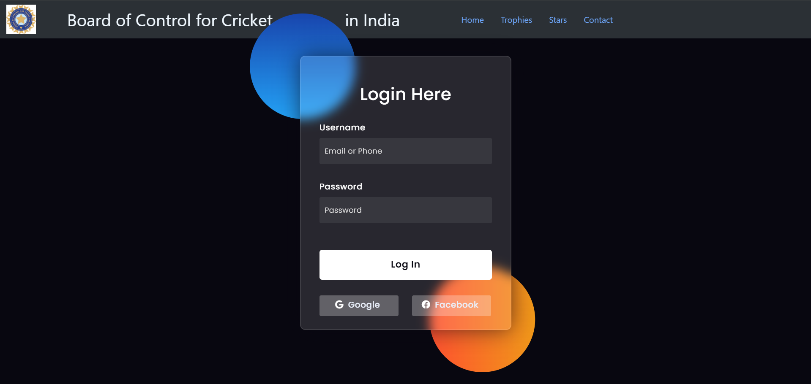
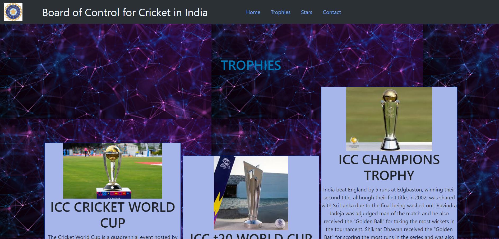
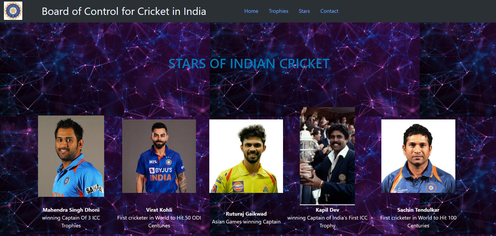
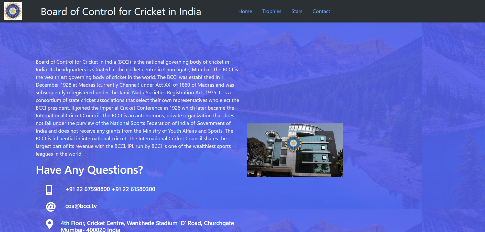

# Ex.07 Software Product Company Website
## Date:26.04.2024

## AIM:
To develop a static company website to display the softwares and services provided by the company.

## DESIGN STEPS:

### Step 1:
Requirement collection.

### Step 2:
Creating the layout using HTML and CSS.

### Step 3:
Updating the sample content.

### Step 4:
Choose the appropriate style and color scheme.

### Step 5:
Validate the layout in various browsers.

### Step 6:
Validate the HTML code.

### Step 7:
Publish the website in the given URL.

## PROGRAM:
home.html:
```
<!DOCTYPE html>
<html lang="en">

<head>
    <title>Home Page</title>

    <link rel="preconnect" href="https://fonts.gstatic.com">
    <link rel="stylesheet" href="https://cdnjs.cloudflare.com/ajax/libs/font-awesome/5.15.4/css/all.min.css">
    <link href="https://fonts.googleapis.com/css2?family=Poppins:wght@300;500;600&display=swap" rel="stylesheet">
    <link href="https://cdn.jsdelivr.net/npm/bootstrap@5.3.3/dist/css/bootstrap.min.css" rel="stylesheet"
        integrity="sha384-QWTKZyjpPEjISv5WaRU9OFeRpok6YctnYmDr5pNlyT2bRjXh0JMhjY6hW+ALEwIH" crossorigin="anonymous">
    <!--Stylesheet-->
    <style media="screen">
        *,
        *:before,
        *:after {
            padding: 0;
            margin: 0;
            box-sizing: border-box;
        }

        body {
            background-color: #080710;
        }

        .background {
            width: 430px;
            height: 520px;
            position: absolute;
            transform: translate(-50%, -50%);
            left: 50%;
            top: 50%;
        }

        .background .shape {
            height: 200px;
            width: 200px;
            position: absolute;
            border-radius: 50%;
        }

        .shape:first-child {
            background: linear-gradient(#1845ad,
                    #23a2f6);
            left: -80px;
            top: -80px;
        }

        .shape:last-child {
            background: linear-gradient(to right,
                    #ff512f,
                    #f09819);
            right: -30px;
            bottom: -80px;
        }

        form {
            height: 520px;
            width: 400px;
            background-color: rgba(255, 255, 255, 0.13);
            position: absolute;
            transform: translate(-50%, -50%);
            top: 50%;
            left: 50%;
            border-radius: 10px;
            backdrop-filter: blur(10px);
            border: 2px solid rgba(255, 255, 255, 0.1);
            box-shadow: 0 0 40px rgba(8, 7, 16, 0.6);
            padding: 50px 35px;
        }

        .bottomdiv {
            background-color: rgb(66, 223, 218);
            color: #007cb9;
            text-align: center;
            position: relative;
            display: block;
            margin-top: 230px;
        }

        form * {
            font-family: 'Poppins', sans-serif;
            color: #ffffff;
            letter-spacing: 0.5px;
            outline: none;
            border: none;
        }

        form h3 {
            font-size: 32px;
            font-weight: 500;
            line-height: 42px;
            text-align: center;
        }

        label {
            display: block;
            margin-top: 30px;
            font-size: 16px;
            font-weight: 500;
        }

        input {
            display: block;
            height: 50px;
            width: 100%;
            background-color: rgba(255, 255, 255, 0.07);
            border-radius: 3px;
            padding: 0 10px;
            margin-top: 8px;
            font-size: 14px;
            font-weight: 300;
        }

        ::placeholder {
            color: #e5e5e5;
        }

        button {
            margin-top: 50px;
            width: 100%;
            background-color: #ffffff;
            color: #080710;
            padding: 15px 0;
            font-size: 18px;
            font-weight: 600;
            border-radius: 5px;
            cursor: pointer;
        }

        .social {
            margin-top: 30px;
            display: flex;
        }

        .social div {
            background: red;
            width: 150px;
            border-radius: 3px;
            padding: 5px 10px 10px 5px;
            background-color: rgba(255, 255, 255, 0.27);
            color: #eaf0fb;
            text-align: center;
        }

        .social div:hover {
            background-color: rgba(255, 255, 255, 0.47);
        }

        .social .fb {
            margin-left: 25px;
        }

        .social i {
            margin-right: 4px;
        }

        .name {
            margin-left: 59px;
            margin-right: 100px;
            font-size: 32px;
            color: aliceblue;
        }

        .bottomdiv {
            background-color: rgb(66, 223, 218);
            color: #007cb9;
            text-align: center;
            position: relative;
            display: block;
            margin-top: 230px;
        }
    </style>
</head>

<body>
    <nav class="navbar justify-content-end navbar-expand-lg bg-body-tertiary bg-primary" data-bs-theme="dark">
        <div class="container-fluid">
            
            <div class="name">Board of Control for Cricket &emsp;&emsp;&emsp;&emsp;in India</div>
            <div class="collapse navbar-collapse" id="navbarTogglerDemo01">
                <ul class="nav justify-content-end">
                    <li class="nav-item">
                        <a class="nav-link active" aria-current="page" href="#">Home</a>
                    </li>
                    <li class="nav-item">
                        <a class="nav-link" href="trophies.html">Trophies</a>
                    </li>
                    <li class="nav-item">
                        <a class="nav-link" href="stars.html">Stars</a>
                    </li>
                    <li class="nav-item">
                        <a class="nav-link" href="contact.html">Contact</a>
                    </li>
                </ul>
            </div>
        </div>
    </nav>
    <div class="background">
        <div class="shape"></div>
        <div class="shape"></div>
    </div>
    <form>
        <h3>Login Here</h3>

        <label for="username">Username</label>
        <input type="text" placeholder="Email or Phone" id="username">

        <label for="password">Password</label>
        <input type="password" placeholder="Password" id="password">

        <button>Log In</button>
        <div class="social">
            <div class="go"><i class="fab fa-google"></i> Google</div>
            <div class="fb"><i class="fab fa-facebook"></i> Facebook</div>
        </div>
    </form>
    <script src="https://cdn.jsdelivr.net/npm/bootstrap@5.3.3/dist/js/bootstrap.bundle.min.js"
        integrity="sha384-YvpcrYf0tY3lHB60NNkmXc5s9fDVZLESaAA55NDzOxhy9GkcIdslK1eN7N6jIeHz"
        crossorigin="anonymous"></script>
</body>

</html>
```

trophies.html:
```
<!DOCTYPE html>
<html lang="en">

<head>
    <title>Home Page</title>

    <link rel="preconnect" href="https://fonts.gstatic.com">
    <link rel="stylesheet" href="https://cdnjs.cloudflare.com/ajax/libs/font-awesome/5.15.4/css/all.min.css">
    <link href="https://fonts.googleapis.com/css2?family=Poppins:wght@300;500;600&display=swap" rel="stylesheet">
    <link href="https://cdn.jsdelivr.net/npm/bootstrap@5.3.3/dist/css/bootstrap.min.css" rel="stylesheet"
        integrity="sha384-QWTKZyjpPEjISv5WaRU9OFeRpok6YctnYmDr5pNlyT2bRjXh0JMhjY6hW+ALEwIH" crossorigin="anonymous">
    <!--Stylesheet-->
    <style media="screen">
        .name {
            margin-left: 59px;
            margin-right: 100px;
            font-size: 32px;
            color: aliceblue;
        }

        .box {
            border-color: rgb(0, 34, 128);
            border-width: 2px;
            border-style: solid;
            display: inline-block;
            width: 414px;
            background-color: rgb(166, 182, 234);
            cursor: pointer;
        }

        .product {

            text-align: center;
        }

        .heading2 {
            padding-top: 100px;
            padding-bottom: 10px;
            text-align: center;
            color: #007cb9;
        }

        .bottomdiv {
            background-color: rgb(66, 223, 218);
            color: #007cb9;
            text-align: center;
            position: relative;
            display: block;
            margin-top: 230px;
        }
    </style>
</head>

<body background="backk.jpg">
    <nav class="navbar justify-content-end navbar-expand-lg bg-body-tertiary bg-primary" data-bs-theme="dark">
        <div class="container-fluid">
            
            <div class="name">Board of Control for Cricket in India</div>
            <div class="collapse navbar-collapse" id="navbarTogglerDemo01">
                <ul class="nav justify-content-end">
                    <li class="nav-item">
                        <a class="nav-link" href="home.html">Home</a>
                    </li>
                    <li class="nav-item">
                        <a class="nav-link active" aria-current="page" href="#">Trophies</a>
                    </li>
                    <li class="nav-item">
                        <a class="nav-link" href="stars.html">Stars</a>
                    </li>
                    <li class="nav-item">
                        <a class="nav-link" href="contact.html">Contact</a>
                    </li>
                </ul>
            </div>
        </div>
    </nav>
    <h1 class="heading2">TROPHIES</h1>
    <br>
    <div class="product">
        <div class="box">
            <b></b>
            <h1> ICC CRICKET WORLD CUP </h1>
            <p>
                The Cricket World Cup is a quadrennial event hosted by the ICC in the ODI format since 1975. There have
                been thirteen editions of the tournament and India has participated in every edition. India have won it
                twice in 1983 and 2011 while also finishing as runners-up in 2003 and 2023.
            </p>
        </div>
        <div class="box">
            
            <h1> ICC t20 WORLD CUP </h1>
            <p>India, led by MS Dhoni, made history by winning the first-ever T20 World Cup in 2007. They triumphed over
                Pakistan in the final. India’s journey included just one loss in the tournament against New Zealand in
                the Super 8s.</p>
        </div>
        <div class="box">
            
            <h1>ICC CHAMPIONS TROPHY</h1>
            <p> India beat England by 5 runs at Edgbaston, winning their second title, although their first title, in
                2002, was shared with Sri Lanka due to the final being washed out. Ravindra Jadeja was adjudged man of
                the match and he also received the "Golden Ball" for taking the most wickets in the tournament. Shikhar
                Dhawan received the "Golden Bat" for scoring the most runs in the series and was also adjudged the Man
                of the Series for his consistent outstanding performances. MS Dhoni became the first captain in history
                to win all three major ICC trophies – World Cup in 2011, World T20 in 2007 and this edition of the
                Champions Trophy.</p>
        </div>
    </div>
    <div class="bottomdiv">
        <b>Copyrights @2024 and Developed by SETHUKKARASI C(212223230201)</b>
    </div>
    <script src="https://cdn.jsdelivr.net/npm/bootstrap@5.3.3/dist/js/bootstrap.bundle.min.js"
        integrity="sha384-YvpcrYf0tY3lHB60NNkmXc5s9fDVZLESaAA55NDzOxhy9GkcIdslK1eN7N6jIeHz"
        crossorigin="anonymous"></script>
</body>

</html>
```

stars.html:
```
<!DOCTYPE html>
<html lang="en">

<head>
    <title>Home Page</title>

    <link rel="preconnect" href="https://fonts.gstatic.com">
    <link rel="stylesheet" href="https://cdnjs.cloudflare.com/ajax/libs/font-awesome/5.15.4/css/all.min.css">
    <link href="https://fonts.googleapis.com/css2?family=Poppins:wght@300;500;600&display=swap" rel="stylesheet">
    <link href="https://cdn.jsdelivr.net/npm/bootstrap@5.3.3/dist/css/bootstrap.min.css" rel="stylesheet"
        integrity="sha384-QWTKZyjpPEjISv5WaRU9OFeRpok6YctnYmDr5pNlyT2bRjXh0JMhjY6hW+ALEwIH" crossorigin="anonymous">
    <!--Stylesheet-->
    <style media="screen">
        .name {
            margin-left: 59px;
            margin-right: 100px;
            font-size: 32px;
            color: aliceblue;
        }

        .person {
            margin: 100px;
            text-align: center;
        }

        .heading2 {
            padding-top: 100px;
            padding-bottom: 10px;
            text-align: center;
            color: #007cb9;
        }

        .bottomdiv {
            background-color: rgb(66, 223, 218);
            color: #007cb9;
            text-align: center;
            position: relative;
            display: block;
            margin-top: 230px;
        }

        b,
        p {
            color: #faf4f4;
            text-align: center;
        }
    </style>
</head>

<body background="backk.jpg">
    <nav class="navbar justify-content-end navbar-expand-lg bg-body-tertiary bg-primary" data-bs-theme="dark">
        <div class="container-fluid">
            
            <div class="name">Board of Control for Cricket in India</div>
            <div class="collapse navbar-collapse" id="navbarTogglerDemo01">
                <ul class="nav justify-content-end">
                    <li class="nav-item">
                        <a class="nav-link" href="home.html">Home</a>
                    </li>
                    <li class="nav-item">
                        <a class="nav-link" href="trophies.html">Trophies</a>
                    </li>
                    <li class="nav-item">
                        <a class="nav-link active" aria-current="page" href="#">Stars</a>
                    </li>
                    <li class="nav-item">
                        <a class="nav-link" href="contact.html">Contact</a>
                    </li>
                </ul>
            </div>
        </div>
    </nav>
    <h1 class="heading2">STARS OF INDIAN CRICKET</h1>
    <table class="person">
        <tr>
            <td>
                
            </td>


            <td>
                
            </td>

            <td>
                
            </td>
            <td>
                
            </td>
            <td>
                
            </td>
        </tr>
        <tr>
            <td>
                <b>Mahendra Singh Dhoni</b>
                <p>winning Captain Of 3 ICC Trophies</p>
            </td>
            <td>
                <b>Virat Kohli</b>
                <p>First cricketer in World to Hit 50 ODI Centuries
                </p>
            </td>
            <td>
                <b>Ruturaj Gaikwad</b>
                <p>Asian Games winning Captain</p>
            </td>
            <td>
                <b>Kapil Dev</b>
                <p>winning Captain of India’s First ICC Trophy</p>
            </td>
            <td>
                <b>Sachin Tendulkar</b>
                <p>First cricketer in World to Hit 100 Centuries</p>
            </td>

        </tr>
    </table>
    <div class="bottomdiv">
        <b>Copyrights @2024 and Developed by SETHUKKARASI C(212223230201)</b>
    </div>
    <script src="https://cdn.jsdelivr.net/npm/bootstrap@5.3.3/dist/js/bootstrap.bundle.min.js"
        integrity="sha384-YvpcrYf0tY3lHB60NNkmXc5s9fDVZLESaAA55NDzOxhy9GkcIdslK1eN7N6jIeHz"
        crossorigin="anonymous"></script>
</body>

</html>
```

contact.html:
```
<!DOCTYPE html>
<html lang="en">

<head>
    <title>Home Page</title>

    <link rel="preconnect" href="https://fonts.gstatic.com">
    <link rel="stylesheet" href="https://cdnjs.cloudflare.com/ajax/libs/font-awesome/5.15.4/css/all.min.css">
    <link href="https://fonts.googleapis.com/css2?family=Poppins:wght@300;500;600&display=swap" rel="stylesheet">
    <link href="https://cdn.jsdelivr.net/npm/bootstrap@5.3.3/dist/css/bootstrap.min.css" rel="stylesheet"
        integrity="sha384-QWTKZyjpPEjISv5WaRU9OFeRpok6YctnYmDr5pNlyT2bRjXh0JMhjY6hW+ALEwIH" crossorigin="anonymous">
    <!--Stylesheet-->
    <style media="screen">
        .overlay {
            background-image: linear-gradient(to right, rgba(90, 100, 232, 0.9), rgba(84, 96, 234, 0.9));
            width: 100%;
            height: 100%;
            z-index: 1;
            position: relative;
            padding: 110px 0;
        }

        h2.contact-title {
            font-size: 35px;
            font-weight: 600;
            color: #fff;
            margin-bottom: 30px;
        }

        .contact-info p {
            color: #ececec;
        }

        ul.contact-info {
            margin-top: 30px;
        }

        ul.contact-info li {
            margin-bottom: 22px;
        }


        ul.contact-info span {
            font-size: 20px;
            line-height: 26px;
        }

        ul.contact-info li {
            display: flex;
            width: 100%;
        }

        .info-left {
            width: 10%;
        }

        .info-left i {
            width: 30px;
            height: 30px;
            line-height: 30px;
            font-size: 30px;
            color: #ffffff;
        }

        .info-right h4 {
            color: #fff;
            font-size: 18px;
        }

        .name {
            margin-left: 59px;
            margin-right: 100px;
            font-size: 32px;
            color: aliceblue;
        }

        .bottomdiv {
            background-color: rgb(66, 223, 218);
            color: #007cb9;
            text-align: center;
            position: relative;
            display: block;
            margin-top: 230px;
        }
    </style>
</head>

<body>
    <nav class="navbar justify-content-end navbar-expand-lg bg-body-tertiary bg-primary" data-bs-theme="dark">
        <div class="container-fluid">
            
            <div class="name">Board of Control for Cricket in India</div>
            <div class="collapse navbar-collapse" id="navbarTogglerDemo01">
                <ul class="nav justify-content-end">
                    <li class="nav-item">
                        <a class="nav-link" href="home.html">Home</a>
                    </li>
                    <li class="nav-item">
                        <a class="nav-link" href="trophies.html">Trophies</a>
                    </li>
                    <li class="nav-item">
                        <a class="nav-link" href="stars.html">Stars</a>
                    </li>
                    <li class="nav-item">
                        <a class="nav-link active" aria-current="page" href="#">Contact</a>
                    </li>
                </ul>
            </div>
        </div>
    </nav>
    <section class="section-bg" style="background-image: url(https://i.ibb.co/9p3Cnk9/slider-2.jpg);"
        data-scroll-index="7">
        <div class="overlay pt-100 pb-100 ">
            <div class="container">
                <div class="row">
                    <div class="col-lg-6 d-flex align-items-center">
                        <div class="contact-info">

                            <p>Board of Control for Cricket in India (BCCI) is the national governing body of cricket in
                                India. Its headquarters is situated at the cricket centre in Churchgate, Mumbai. The
                                BCCI is the wealthiest governing body of cricket in the world.

                                The BCCI was established in 1 December 1928 at Madras (currently Chennai) under Act XXI
                                of 1860 of Madras and was subsequently reregistered under the Tamil Nadu Societies
                                Registration Act, 1975. It is a consortium of state cricket associations that select
                                their own representatives who elect the BCCI president. It joined the Imperial Cricket
                                Conference in 1926 which later became the International Cricket Council. The BCCI is an
                                autonomous, private organization that does not fall under the purview of the National
                                Sports Federation of India of Government of India and does not receive any grants from
                                the Ministry of Youth Affairs and Sports. The BCCI is influential in international
                                cricket. The International Cricket Council shares the largest part of its revenue with
                                the BCCI. IPL run by BCCI is one of the wealthiest sports leagues in the world.</p>
                            <h2 class="contact-title">Have Any Questions?</h2>

                            <ul class="contact-info">
                                <li>
                                    <div class="info-left">
                                        <i class="fas fa-mobile-alt"></i>
                                    </div>
                                    <div class="info-right">
                                        <h4>+91 22 67598800
                                            +91 22 61580300</h4>
                                    </div>
                                </li>
                                <li>
                                    <div class="info-left">
                                        <i class="fas fa-at"></i>
                                    </div>
                                    <div class="info-right">
                                        <h4>coa@bcci.tv</h4>
                                    </div>
                                </li>
                                <li>
                                    <div class="info-left">
                                        <i class="fas fa-map-marker-alt"></i>
                                    </div>
                                    <div class="info-right">
                                        <h4>4th Floor, Cricket Centre,
                                            Wankhede Stadium
                                            ‘D’ Road,
                                            Churchgate
                                            Mumbai- 400020
                                            India</h4>
                                    </div>
                                </li>
                            </ul>
                        </div>
                    </div>
                    <div class="col-lg-6 d-flex align-items-center sele">
                        
                    </div>
                </div>
            </div>
        </div>
    </section>
    <div class="bottomdiv">
        <b>Copyrights @2024 and Developed by SETHUKKARASI C(212223230201)</b>
    </div>
    <script src="https://cdn.jsdelivr.net/npm/bootstrap@5.3.3/dist/js/bootstrap.bundle.min.js"
        integrity="sha384-YvpcrYf0tY3lHB60NNkmXc5s9fDVZLESaAA55NDzOxhy9GkcIdslK1eN7N6jIeHz"
        crossorigin="anonymous"></script>
</body>

</html>
```

## OUTPUT:









## RESULT:
The program for designing software company website using HTML and CSS is completed successfully.
